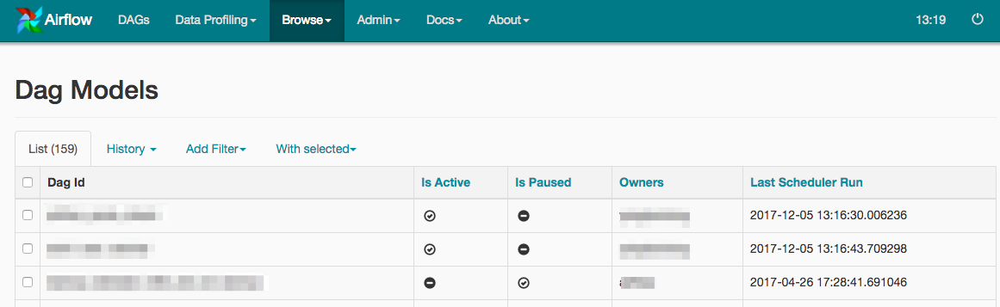

# Airflow DAG Status Manager Plugin

### Description
A plugin for [Apache Airflow](https://github.com/apache/incubator-airflow) that manage '**is_active**' and '**is_pause**' for your DAG with web UI.

The plugin will record the full change history for these two properties, and you can restore to any version.

### System Requirements

+ Airflow Versions
    + 1.X

### Deployment Instructions

1. Create the plugins folder if it doesn't exist. 
    + The location you should put it is usually at {AIRFLOW_HOME}/plugins. The specific location can be found in your airflow.cfg file:

        plugins_folder = /home/{USER_NAME}/airflow/plugins

2. Download the code
    + URL to Download From:

        https://github.com/lattebank/airflow-dag-status-manager-plugin/archive/master.zip

3. Unzip the file and move the contents of the plugins folder into your Airflow plugins directory

        unzip airflow-dag-status-manager-plugin-{RELEASE_VERSION_OR_BRANCH_NAME}.zip

        cp -r airflow-dag-status-manager-plugin-{RELEASE_VERSION_OR_BRANCH_NAME}/plugins/* {AIRFLOW_PLUGINS_FOLDER} 

4. Upgrade database

        python {AIRFLOW_PLUGINS_FOLDER}/dag_available_plugin/tools/upgradedb.py

5. Restart the Airflow Web Server

### Using DAG Status Manager

Once you deploy the plugin and restart the web server, you can start to use the DAG Status Manager. When you reload the Airflow Web Server page, you will see a link under the Browse tab called "DAG Models". Clicking on the link will navigate you to the following URL:

http://{AIRFLOW_HOST}:{AIRFLOW_PORT}/admin/dagavailable/

Now, you can manage your DAG in this web page. Enjoy!